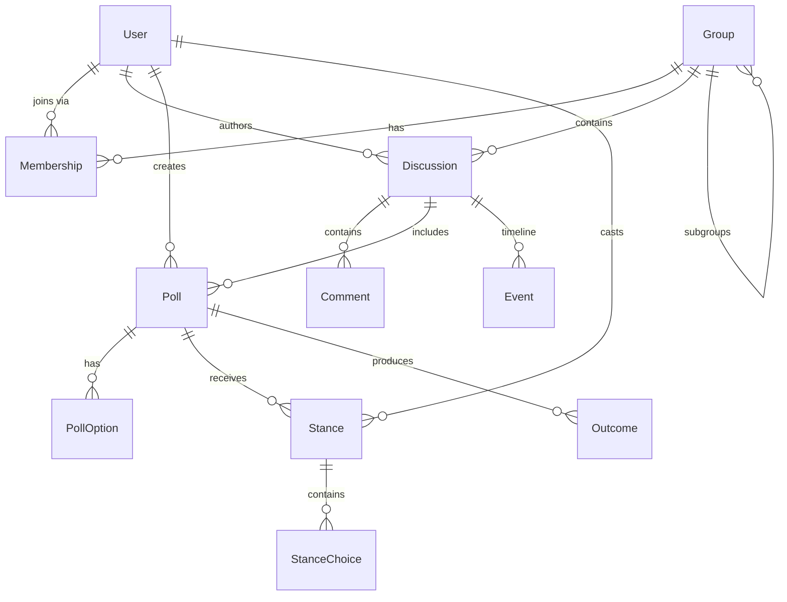

# Loomio Architecture Overview

> Synthesized reference for Go rewrite. See themed documents for details.

## Purpose

Loomio is a collaborative decision-making platform enabling groups to discuss topics, create proposals, and reach consensus through structured voting.

## Technology Stack

| Component | Technology | Notes |
|-----------|------------|-------|
| Framework | Ruby on Rails 7.2 | Main application |
| Database | PostgreSQL 17 | citext, hstore, pgcrypto extensions |
| Cache/Queue | Redis 8.4 | Sidekiq, pub/sub, sessions |
| Background Jobs | Sidekiq 7.0 | 38 workers, 10 queue priorities |
| Real-time | Socket.io + Hocuspocus | Node.js channel server |
| Frontend | Vue 3 | SPA with TipTap editor |
| Auth | Devise + CanCan | OAuth, SAML support |
| Search | pg_search | PostgreSQL full-text |
| File Storage | ActiveStorage | S3, GCS, local options |

## Core Domain Model

## Key Architectural Patterns

| Pattern | Implementation | Go Equivalent |
|---------|----------------|---------------|
| Service Layer | 43 service classes (`app/services/`) | Interface-based services |
| Event-Driven | EventBus broadcasts, Redis pub/sub | Channels + goroutines |
| Soft Deletes | `discard` gem, `discarded_at` timestamp | GORM soft delete |
| Counter Caches | 17+ counters on groups alone | DB triggers or app-level |
| Polymorphic | Events, Reactions, Documents | Interface types |
| Authorization | CanCan ability modules | Casbin or custom |

## Themed Documents

| Document | Content |
|----------|---------|
| [models.md](./models.md) | Core entities, associations, poll types (9), event kinds (42) |
| [database.md](./database.md) | Schema (57 tables), indexes, JSONB structures, query patterns |
| [api.md](./api.md) | Routes, serializers, webhooks (14 eligible), rate limiting |
| [authorization.md](./authorization.md) | CanCan abilities, permission model |
| [jobs.md](./jobs.md) | Sidekiq workers (38), scheduled tasks |
| [realtime.md](./realtime.md) | Channel server, Redis pub/sub protocols |
| [frontend.md](./frontend.md) | Vue SPA, Socket.io, Hocuspocus/TipTap |
| [deployment.md](./deployment.md) | Docker Compose (10 services), configuration |
| [questions.md](./questions.md) | Unanswered questions with source references |

## Key Numbers

| Metric | Count |
|--------|-------|
| Database tables | 57 |
| API endpoints (v1) | 28 resources |
| Poll types | 9 (not 7 as initially documented) |
| Event kinds | 42 (14 webhook-eligible) |
| Background workers | 38 |
| Service classes | 43 |
| Ability modules | 25 |
| Counter caches (groups) | 17 |

## Go Rewrite Priorities

1. **Poll Types**: Implement all 9 types (`proposal`, `poll`, `count`, `score`, `ranked_choice`, `meeting`, `dot_vote`, `check`, `question`)
2. **Event System**: Support all 42 event kinds; 14 are webhook-eligible
3. **Real-time**: Redis pub/sub contract is well-defined (see [realtime.md](./realtime.md))
4. **Hocuspocus**: Ephemeral by design; Rails DB is source of truth
5. **Volume Levels**: 0=mute, 1=quiet, 2=normal, 3=loud with distinct notification behaviors
6. **Environment Variables**: `env_template` in loomio-deploy is the source of truth

---

*Synthesized: 2026-01-31*
