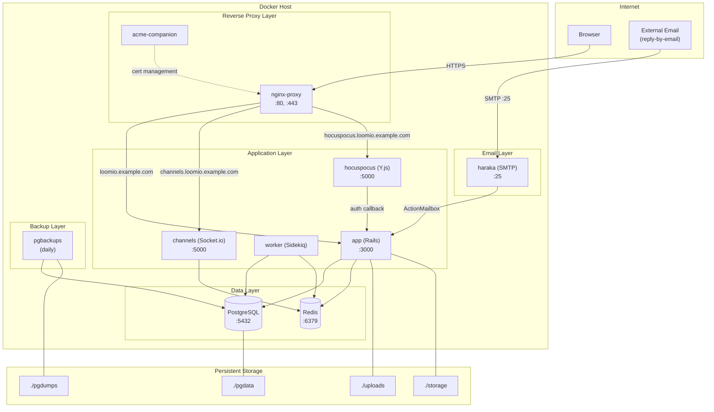
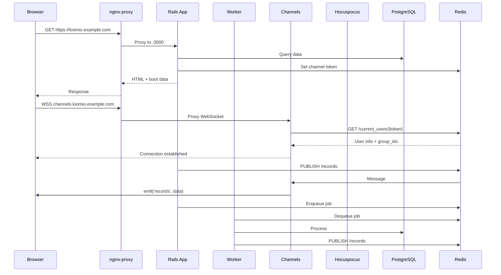

# Loomio Deploy Initial Investigation

This document provides a comprehensive analysis of the `loomio-deploy` repository, which handles deployment orchestration for the Loomio collaborative decision-making platform.

## Table of Contents

1. [Overview](#1-overview)
2. [Deployed Services](#2-deployed-services)
3. [Networking Environment](#3-networking-environment)
4. [Third-Party Services and Integrations](#4-third-party-services-and-integrations)
5. [Configuration](#5-configuration)
6. [Shell Scripts](#6-shell-scripts)
7. [Architecture Diagram](#7-architecture-diagram)
8. [Operational Procedures](#8-operational-procedures)
9. [Cross-Repository Integration Points](#9-cross-repository-integration-points)
10. [Vue Frontend Real-Time Integration](#10-vue-frontend-real-time-integration)
11. [Important Notes for Go Rewrite](#11-important-notes-for-go-rewrite)

---

## 1. Overview

### Deployment Philosophy

The `loomio-deploy` repository implements a **single-host Docker Compose deployment** designed for small to medium-scale Loomio installations. Key characteristics:

- **Simplicity over scale**: No Kubernetes, Ansible, or Terraform
- **Automatic SSL**: Let's Encrypt integration via nginx-proxy
- **Self-contained**: All services run on a single host
- **Configuration-driven**: Extensive environment variables for customization

### Repository Structure

```
loomio-deploy/
├── docker-compose.yml     # Service orchestration (164 lines)
├── env_template           # Configuration template (230 lines)
├── nginx.conf             # Upload size override (1 line)
├── README.md              # Deployment guide (239 lines)
├── create_env.sh          # Environment setup script
├── create_backup.sh       # Manual backup script
├── create_swapfile.sh     # Memory setup for low-RAM servers
├── update.sh              # Upgrade procedure script
├── .backup-ignore         # Backup exclusions
├── .gitignore             # Git exclusions
└── .github/
    └── FUNDING.yml        # GitHub sponsorship config
```

### Key Files

| File | Size | Purpose |
|------|------|---------|
| `docker-compose.yml` | 164 lines | Defines all 10 services, networks, volumes |
| `env_template` | 230 lines | Template with 60+ configurable variables |
| `README.md` | 239 lines | Complete deployment guide |
| `nginx.conf` | 1 line | Sets `client_max_body_size 200m` |

---

## 2. Deployed Services

The deployment consists of **10 Docker containers** orchestrated via Docker Compose.

### 2.1 nginx-proxy (Reverse Proxy)

**Source**: `docker-compose.yml:2-17`

```yaml
nginx-proxy:
  image: nginxproxy/nginx-proxy:alpine
  ports:
    - 80:80
    - 443:443
  volumes:
    - ./nginx.conf:/etc/nginx/conf.d/custom.conf:ro
    - certs:/etc/nginx/certs
    - /var/run/docker.sock:/tmp/docker.sock:ro
```

**Purpose**:
- Routes HTTP/HTTPS traffic to internal services based on `VIRTUAL_HOST` labels
- Terminates SSL connections
- Auto-discovers containers via Docker socket

### 2.2 nginx-proxy-acme (SSL Certificate Manager)

**Source**: `docker-compose.yml:19-31`

```yaml
nginx-proxy-acme:
  image: nginxproxy/acme-companion
  depends_on:
    - nginx-proxy
  volumes:
    - certs:/etc/nginx/certs
    - acme:/etc/acme.sh
```

**Purpose**:
- Automatically obtains Let's Encrypt SSL certificates
- Renews certificates before expiration
- Uses ACME HTTP-01 challenge

### 2.3 app (Rails Application)

**Source**: `docker-compose.yml:33-56`

```yaml
app:
  container_name: loomio-app
  image: ${LOOMIO_CONTAINER_IMAGE}:${LOOMIO_CONTAINER_TAG}
  healthcheck:
    test: ['CMD-SHELL', 'curl --fail http://localhost:3000/ || exit 1']
  expose:
    - 3000
  environment:
    - VIRTUAL_HOST=${CANONICAL_HOST}
    - LETSENCRYPT_HOST=${CANONICAL_HOST}
  depends_on:
    - db
    - redis
```

**Volumes** (lines 45-51):
- `./uploads:/loomio/public/system` - User file uploads
- `./storage:/loomio/storage` - ActiveStorage files
- `./files:/loomio/public/files` - Static files
- `./plugins:/loomio/plugins/docker` - Custom plugins
- `./import:/import` - Import data directory
- `./tmp:/loomio/tmp` - Temporary files

**Purpose**: Main Ruby on Rails application handling all business logic.

### 2.4 worker (Background Job Processor)

**Source**: `docker-compose.yml:58-72`

```yaml
worker:
  container_name: loomio-worker
  image: ${LOOMIO_CONTAINER_IMAGE}:${LOOMIO_CONTAINER_TAG}
  environment:
    - TASK=worker
```

**Purpose**:
- Runs Sidekiq for background job processing
- Handles: notifications, email sending, poll closing, digest emails
- Shares same image as `app` but with `TASK=worker` environment variable

### 2.5 db (PostgreSQL Database)

**Source**: `docker-compose.yml:74-87`

```yaml
db:
  container_name: loomio-db
  image: postgres:${POSTGRES_CONTAINER_TAG}  # Default: 17
  healthcheck:
    test: ['CMD', 'pg_isready', '-U', 'postgres']
  volumes:
    - ./pgdata:/pgdata
    - ./pgdumps:/pgdumps
  environment:
    - PGDATA=/pgdata
```

**Purpose**: Primary data store for all Loomio data.

### 2.6 redis (Cache and Message Broker)

**Source**: `docker-compose.yml:89-96`

```yaml
redis:
  container_name: loomio-redis
  image: redis:8.4
  healthcheck:
    test: ['CMD', 'redis-cli', 'ping']
```

**Purpose**:
- Sidekiq job queue
- Session/cache storage
- Pub/sub for real-time updates between Rails and Channel Server

### 2.7 haraka (SMTP Server)

**Source**: `docker-compose.yml:98-106`

```yaml
haraka:
  container_name: loomio-haraka
  image: ${HARAKA_CONTAINER_IMAGE}:${HARAKA_CONTAINER_TAG}
  ports:
    - "25:25"
```

**Purpose**:
- Receives inbound emails for "reply-by-email" functionality
- Forwards to Rails ActionMailbox endpoint
- Listens on standard SMTP port 25

### 2.8 channels (WebSocket Server)

**Source**: `docker-compose.yml:108-119`

```yaml
channels:
  container_name: loomio-channels
  image: ${CHANNELS_CONTAINER_IMAGE}:${CHANNELS_CONTAINER_TAG}
  depends_on:
    - redis
  environment:
    - VIRTUAL_HOST=channels.${CANONICAL_HOST}
    - LETSENCRYPT_HOST=channels.${CANONICAL_HOST}
```

**Purpose**:
- Handles WebSocket connections for real-time updates
- Broadcasts record changes to connected clients
- Uses Socket.io protocol

### 2.9 hocuspocus (Collaborative Editing Server)

**Source**: `docker-compose.yml:121-131`

```yaml
hocuspocus:
  container_name: loomio-hocuspocus
  image: ${CHANNELS_CONTAINER_IMAGE}:${CHANNELS_CONTAINER_TAG}
  command: npm run hocuspocus
  environment:
    - VIRTUAL_HOST=hocuspocus.${CANONICAL_HOST}
    - LETSENCRYPT_HOST=hocuspocus.${CANONICAL_HOST}
```

**Purpose**:
- Real-time collaborative document editing
- Uses Hocuspocus (Yjs/Y.js protocol)
- Separate subdomain from channels server

**Note**: Uses same image as `channels` but different command (`npm run hocuspocus`).

### 2.10 pgbackups (Automated Database Backups)

**Source**: `docker-compose.yml:133-155`

```yaml
pgbackups:
  image: prodrigestivill/postgres-backup-local
  environment:
    - POSTGRES_HOST=db
    - POSTGRES_DB=loomio_production
    - SCHEDULE=@daily
    - BACKUP_KEEP_DAYS=7
    - BACKUP_KEEP_WEEKS=1
    - BACKUP_KEEP_MONTHS=1
```

**Purpose**:
- Automated daily PostgreSQL backups
- Retention: 7 daily, 1 weekly, 1 monthly
- Stores backups in `./pgdumps` directory

---

## 3. Networking Environment

### 3.1 DNS Requirements

**Source**: `README.md:17-37`

Required DNS records for hostname `loomio.example.com` at IP `192.0.2.1`:

| Record Type | Name | Value | Purpose |
|-------------|------|-------|---------|
| A | loomio.example.com | 192.0.2.1 | Main application |
| MX | loomio.example.com | loomio.example.com (priority 0) | Reply-by-email |
| CNAME | channels.loomio.example.com | loomio.example.com | WebSocket server |
| CNAME | hocuspocus.loomio.example.com | loomio.example.com | Collaborative editing |

### 3.2 Port Mappings

| Port | Service | Protocol | Exposure |
|------|---------|----------|----------|
| 80 | nginx-proxy | HTTP | Public (redirects to 443) |
| 443 | nginx-proxy | HTTPS | Public |
| 25 | haraka | SMTP | Public (inbound email) |
| 3000 | app | HTTP | Internal only |
| 6379 | redis | Redis | Internal only |
| 5432 | db | PostgreSQL | Internal only |

### 3.3 Internal Docker Network

**Source**: `docker-compose.yml:156-157`

```yaml
networks:
  main:
```

All services join a single `main` bridge network, enabling hostname-based service discovery:

- `db` → PostgreSQL at `postgresql://postgres:password@db/loomio_production`
- `redis` → Redis at `redis://redis:6379/0`
- `app` → Rails at `http://app:3000`

### 3.4 Virtual Host Routing

nginx-proxy routes based on `VIRTUAL_HOST` environment variable:

| Hostname | Service | Port |
|----------|---------|------|
| `${CANONICAL_HOST}` | app | 3000 |
| `channels.${CANONICAL_HOST}` | channels | 5000 |
| `hocuspocus.${CANONICAL_HOST}` | hocuspocus | 5000 |

---

## 4. Third-Party Services and Integrations

### 4.1 Required External Services

| Service | Purpose | Configuration |
|---------|---------|---------------|
| SMTP Provider | Outbound email | `SMTP_*` variables in env_template:38-46 |

### 4.2 Optional Integrations

**Source**: `env_template:108-127`

| Service | Purpose | Config Variable |
|---------|---------|-----------------|
| Sentry | Error tracking | `SENTRY_PUBLIC_DSN` (line 109) |
| Plausible | Analytics | `PLAUSIBLE_SRC`, `PLAUSIBLE_SITE` (lines 112-113) |
| Google Translate | Content translation | `TRANSLATE_CREDENTIALS` (line 123) |
| OpenAI | Audio transcription | `OPENAI_API_KEY` (line 126) |

### 4.3 Authentication Providers

**Source**: `env_template:115-168`

| Provider | Config Variables | Lines |
|----------|------------------|-------|
| Facebook OAuth | `FACEBOOK_APP_KEY`, `FACEBOOK_APP_SECRET` | 116-117 |
| Google OAuth | `GOOGLE_APP_KEY`, `GOOGLE_APP_SECRET` | 118-119 |
| SAML SSO | `SAML_APP_KEY`, `SAML_IDP_METADATA_URL`, `SAML_ISSUER` | 128-136 |
| OAuth2/OIDC | `OAUTH_AUTH_URL`, `OAUTH_TOKEN_URL`, etc. | 138-168 |

### 4.4 Cloud Storage Options

**Source**: `env_template:72-95`

| Provider | Config Variables | Lines |
|----------|------------------|-------|
| Local | `ACTIVE_STORAGE_SERVICE=local` | 75 |
| AWS S3 | `AWS_*` variables | 77-81 |
| DigitalOcean Spaces | `DO_*` variables | 83-87 |
| S3-Compatible | `STORAGE_*` variables | 89-95 |

---

## 5. Configuration

### 5.1 Core Settings

**Source**: `env_template:1-36`

| Variable | Line | Purpose | Example |
|----------|------|---------|---------|
| `SITE_NAME` | 10 | Display name | "Loomio" |
| `CANONICAL_HOST` | 13 | Primary hostname | "loomio.example.com" |
| `PUBLIC_APP_URL` | 16 | Public HTTPS URL | "https://loomio.example.com" |
| `PRIVATE_APP_URL` | 19 | Internal service URL | "http://app:3000" |
| `SUPPORT_EMAIL` | 22 | Admin contact | "admin@example.com" |
| `REPLY_HOSTNAME` | 25 | MX record hostname | "loomio.example.com" |
| `CHANNELS_URL` | 32 | WebSocket URL (client) | "wss://channels.loomio.example.com" |
| `HOCUSPOCUS_URL` | 33 | Collaborative edit URL | "wss://hocuspocus.loomio.example.com" |

### 5.2 Security Settings

**Source**: `env_template:53-67`

| Variable | Line | Purpose |
|----------|------|---------|
| `FORCE_SSL` | 54 | Redirect HTTP to HTTPS |
| `ASSUME_SSL` | 57 | Skip redirect when behind SSL proxy |
| `USE_RACK_ATTACK` | 60 | Enable rate limiting |
| `RACK_ATTACK_RATE_MULTPLIER` | 61 | Rate limit multiplier |
| `POSTGRES_PASSWORD` | 65 | Database password (auto-generated) |

### 5.3 Secret Generation

**Source**: `env_template:226-228`

Four critical secrets are auto-generated by `create_env.sh`:

| Variable | Purpose |
|----------|---------|
| `DEVISE_SECRET` | Rails authentication encryption |
| `SECRET_COOKIE_TOKEN` | Session cookie signing |
| `POSTGRES_PASSWORD` | Database authentication |
| `RAILS_INBOUND_EMAIL_PASSWORD` | ActionMailbox endpoint auth |

### 5.4 Feature Flags

**Source**: `env_template:97-103`

| Variable | Effect |
|----------|--------|
| `FEATURES_DISABLE_CREATE_USER=1` | Users must be invited |
| `FEATURES_DISABLE_CREATE_GROUP=1` | Only admins can create groups |
| `FEATURES_DISABLE_PUBLIC_GROUPS=1` | Disable /explore page |
| `FEATURES_DISABLE_HELP_LINK=1` | Hide help link |
| `FEATURES_DISABLE_EMAIL_LOGIN=1` | Force SSO login |

### 5.5 Performance Tuning

**Source**: `env_template:48-51`

| Variable | Default | Purpose |
|----------|---------|---------|
| `PUMA_WORKERS` | 1 | Web server processes |
| `MIN_THREADS` | 3 | Minimum thread pool |
| `MAX_THREADS` | 3 | Maximum thread pool |

### 5.6 Theming

**Source**: `env_template:170-221`

| Variable | Purpose |
|----------|---------|
| `THEME_ICON_SRC` | Favicon URL |
| `THEME_APP_LOGO_SRC` | App logo (prefer SVG) |
| `THEME_PRIMARY_COLOR` | Primary theme color |
| `THEME_ACCENT_COLOR` | Accent color |
| `THEME_DEFAULT_DARK_THEME` | Dark mode variant |

---

## 6. Shell Scripts

### 6.1 create_env.sh (Environment Setup)

**Source**: `create_env.sh:1-28`

```bash
#!/bin/sh
set -e

if [ $# -lt 2 ]; then
  echo "Usage: $0 <hostname> <contact_email>"
  exit 1
fi

rand() {
  openssl rand -hex 32
}

POSTGRES_PASSWORD="$(rand)"
DEVISE_SECRET="$(rand)"
SECRET_COOKIE_TOKEN="$(rand)"
RAILS_INBOUND_EMAIL_PASSWORD="$(rand)"

sed -e "s|REPLACE_WITH_HOSTNAME|${1}|g" \
    -e "s|REPLACE_WITH_CONTACT_EMAIL|${2}|g" \
    # ... (substitutions for secrets)
    env_template > .env

chmod 600 .env
```

**Purpose**:
- Generates secure random 32-byte hex secrets
- Substitutes placeholders in `env_template`
- Creates `.env` with restricted permissions (600)

**Usage**: `./create_env.sh loomio.example.com admin@example.com`

### 6.2 create_swapfile.sh (Memory Setup)

**Source**: `create_swapfile.sh:1-8`

```bash
#!/bin/sh
# fallocate -l 4G /swapfile  # Alternative method (commented)
dd if=/dev/zero of=/swapfile count=4000 bs=1MiB
chmod 600 /swapfile
mkswap /swapfile
swapon /swapfile
echo "/swapfile   none    swap    sw    0   0" >> /etc/fstab
```

**Purpose**: Creates 4GB swapfile for servers with <2GB RAM.

### 6.3 create_backup.sh (Manual Backup)

**Source**: `create_backup.sh:1-22`

```bash
#!/bin/bash
SOURCE_DIR=$1
BACKUP_RETENTION_DAYS=1

BACKUP_DIR=$SOURCE_DIR/backups
DAY_OF_MONTH=`date '+%-d'`
MOD_DAYS=$(($DAY_OF_MONTH % $BACKUP_RETENTION_DAYS))
DEST_FILE=$BACKUP_DIR/`hostname`-$MOD_DAYS.tgz

# Dump database
docker exec loomio-db su - postgres -c 'pg_dump -O -Fc loomio_production -f /pgdumps/loomio_production.dump'

# Create tarball excluding items in .backup-ignore
tar cvzf $DEST_FILE -X $SOURCE_DIR/.backup-ignore $SOURCE_DIR
```

**Purpose**:
- Creates PostgreSQL dump in custom format
- Archives database + uploads + config
- Rotates by day-of-month (default: 1 backup)

**Usage**: `./create_backup.sh .`

### 6.4 update.sh (Upgrade Procedure)

**Source**: `update.sh:1-3`

```bash
#!/bin/bash
docker system prune -a -f && \
docker compose pull && \
docker compose down && \
docker compose run app rake db:migrate && \
docker compose down && \
docker compose up -d --remove-orphans
```

**Purpose**:
- Removes unused Docker images
- Pulls latest container versions
- Runs database migrations
- Restarts all services

---

## 7. Architecture Diagram



### Service Communication Flow



---

## 8. Operational Procedures

### 8.1 Initial Setup Workflow

**Source**: `README.md:39-149`

```bash
# 1. Install Docker (lines 48-67)
sudo apt-get install docker-ce docker-ce-cli containerd.io docker-compose-plugin

# 2. Clone repository (lines 74-77)
git clone https://github.com/loomio/loomio-deploy.git
cd loomio-deploy

# 3. Create swap if needed (lines 81-88)
./create_swapfile.sh

# 4. Generate .env file (lines 95-97)
./create_env.sh loomio.example.com admin@example.com

# 5. Configure SMTP in .env (lines 107-119)

# 6. Initialize database (lines 126-129)
docker compose up -d db
docker compose run app rake db:setup

# 7. Start all services (lines 147-149)
docker compose up -d
```

### 8.2 Crontab Configuration

**Source**: `README.md:131-142`

Required cron entry for background tasks:

```bash
0 * * * *  /usr/bin/docker exec loomio-worker bundle exec rake loomio:hourly_tasks > ~/rake.log 2>&1
```

Tasks executed hourly (from `orig/loomio/lib/tasks/loomio.rake:222-248`):

| Task | Purpose |
|------|---------|
| `PollService.expire_lapsed_polls` | Close expired polls |
| `PollService.publish_closing_soon` | Alert on closing polls |
| `TaskService.send_task_reminders` | Send task reminders |
| `ReceivedEmailService.route_all` | Process unrouted emails |
| `SendDailyCatchUpEmailWorker` | Send digest emails |
| `ThrottleService.reset!('hour')` | Reset rate limits |

### 8.3 Backup Procedures

**Source**: `README.md:208-228`

**Automatic Backups** (via pgbackups service):
```bash
# Setup permissions
mkdir -p pgdumps && chown -R 999:999 pgdumps
```

**Manual SQL Dump**:
```bash
docker exec -ti loomio-db su - postgres -c 'pg_dump -c loomio_production' > loomio_production.sql
```

**Restore from SQL**:
```bash
cat loomio_production.sql | docker exec -i loomio-db su - postgres -c 'psql loomio_production'
```

### 8.4 Version Upgrade Path

**Source**: `README.md:230-238`

Sequential upgrades required:

```
v2.4.2 → v2.8.8 → v2.11.13 → v2.15.4 → v2.17.1 → stable
```

**Procedure per version**:
1. Edit `.env`: Set `LOOMIO_CONTAINER_TAG=v2.x.x`
2. Run `./update.sh`
3. Wait for migrations to complete
4. Repeat for next version

### 8.5 Admin Access

**Source**: `README.md:165-172`

Grant admin rights via Rails console:

```bash
docker compose run app rails c
User.last.update(is_admin: true)
```

Admin interface available at `https://loomio.example.com/admin`

---

## 9. Cross-Repository Integration Points

### 9.1 Rails App → Deploy Configuration

**Environment Variables Consumed by Rails**

The Rails app (`orig/loomio/config/application.rb`) consumes these deployment variables:

| Category | Variables | Rails Location |
|----------|-----------|----------------|
| Database | `DATABASE_URL` | `config/database.yml` |
| Redis | `REDIS_URL`, `REDIS_QUEUE_URL`, `REDIS_CACHE_URL` | `config/initializers/sidekiq.rb:1-24` |
| Email | `SMTP_*`, `RAILS_INBOUND_EMAIL_PASSWORD` | `config/application.rb:48-55` |
| SSL | `FORCE_SSL`, `ASSUME_SSL` | `config/environments/production.rb` |
| Storage | `ACTIVE_STORAGE_SERVICE`, `AWS_*`, `DO_*` | `config/storage.yml` |
| Auth | `DEVISE_SECRET`, `SECRET_KEY_BASE` | `config/initializers/devise.rb` |

**WebSocket Token Setup (Boot Controller)**

**Source**: `orig/loomio/app/controllers/api/v1/boot_controller.rb:26-33`

```ruby
def set_channel_token
  CACHE_REDIS_POOL.with do |client|
    client.set("/current_users/#{current_user.secret_token}",
      {name: current_user.name,
       group_ids: current_user.group_ids,
       id: current_user.id}.to_json)
  end
end
```

When user loads the app (`GET /api/v1/boot`), Rails stores auth data in Redis at key `/current_users/{secret_token}`. The channel server uses this for WebSocket authentication.

**Redis Pub/Sub (MessageChannelService)**

**Source**: `orig/loomio/app/services/message_channel_service.rb:1-32`

Rails publishes to two Redis channels:

1. **`/records`** (line 17-23) - Model updates

   ```json
   {
     "room": "user-123" or "group-456",
     "records": { /* serialized data */ }
   }
   ```

2. **`/system_notice`** (line 25-31) - System announcements

   ```json
   {
     "version": "current_version",
     "notice": "message_text",
     "reload": true/false
   }
   ```

**ActionMailbox Inbound Email**

**Source**: `orig/loomio/app/mailboxes/received_email_mailbox.rb:1-62`

- Haraka posts to: `http://app:3000/rails/action_mailbox/relay/inbound_emails`
- Protected by `RAILS_INBOUND_EMAIL_PASSWORD`
- `ReceivedEmailMailbox` processes incoming emails and routes them to discussions

### 9.2 Channel Server → Deploy Configuration

**Redis Subscriptions**

**Source**: `orig/loomio_channel_server/records.js:35-42`

```javascript
await redisSub.subscribe('/records', (json, channel) => {
  let data = JSON.parse(json)
  io.to(data.room).emit('records', data)
})

await redisSub.subscribe('/system_notice', (json, channel) => {
  io.emit('notice', JSON.parse(json))
})
```

**WebSocket Authentication Flow**

**Source**: `orig/loomio_channel_server/records.js:44-56`

```javascript
io.on("connection", async (socket) => {
  socket.join("notice")

  let channel_token = socket.handshake.query.channel_token
  let user = await redis.get("/current_users/"+channel_token)

  if (user) {
    user = JSON.parse(user)
    socket.join("user-"+user.id)
    user.group_ids.forEach(groupId => { socket.join("group-"+groupId) })
  }
})
```

1. Client connects with `channel_token` query parameter
2. Server looks up `/current_users/{token}` in Redis
3. If valid, client joins personal room (`user-{id}`) and group rooms (`group-{groupId}`)
4. All clients auto-join `notice` room for system broadcasts

**Hocuspocus Authentication**

**Source**: `orig/loomio_channel_server/hocuspocus.mjs:36-49`

```javascript
async onAuthenticate(data) {
  const { token, documentName } = data;
  const response = await fetch(authUrl, {
    method: 'POST',
    body: JSON.stringify({ user_secret: token, document_name: documentName }),
    headers: { 'Content-type': 'application/json; charset=UTF-8' },
  })

  if (response.status != 200) {
    throw new Error("Not authorized!");
  }
  return true;
}
```

- Hocuspocus validates via HTTP POST to `http://app:3000/api/hocuspocus`
- Separate from channel server auth (uses HTTP callback, not Redis lookup)

### 9.3 Environment Variable Contract

Variables that must match between deploy and applications:

| Variable | Used By | Purpose |
|----------|---------|---------|
| `REDIS_URL` | Rails, Channels, Hocuspocus | Service discovery |
| `CANONICAL_HOST` | All | Hostname consistency |
| `PRIVATE_APP_URL` | Hocuspocus | Internal Rails URL for auth callbacks |
| `RAILS_INBOUND_EMAIL_PASSWORD` | Rails, Haraka | Email endpoint authentication |
| `SECRET_COOKIE_TOKEN` | Rails | Session encryption key |

---

## 10. Vue Frontend Real-Time Integration

This section documents how the Vue.js frontend (`orig/loomio/vue`) integrates with the WebSocket and Hocuspocus servers.

### 10.1 Socket.io Client Setup

**Source**: `orig/loomio/vue/src/shared/helpers/message_bus.js:9-37`

```javascript
import io from 'socket.io-client';

let conn = null;

export var initLiveUpdate = function() {
  conn = io(AppConfig.theme.channels_url, {
    query: { channel_token: AppConfig.channel_token }
  });

  conn.on('records', data => {
    Records.importJSON(data.records);
  });

  conn.on('notice', data => {
    EventBus.$emit('systemNotice', data);
  });
};
```

**Key Configuration**:
- **Server URL**: `AppConfig.theme.channels_url` (e.g., `wss://channels.example.com`)
- **Auth Token**: `channel_token` passed in query string (user's `secret_token`)
- **Events**: `records` (model updates), `notice` (system broadcasts)

### 10.2 Boot Process Flow

**Source**: `orig/loomio/vue/src/shared/helpers/boot.js:8-28`

```
1. main.js:24         → boot() called on app init
2. boot.js:9          → GET /api/v1/boot/site
3. Rails controller   → set_channel_token (stores in Redis)
4. boot.js:10         → Response merged into AppConfig
5. Session.apply()    → Records.importJSON(data) for initial store
6. app.vue:51         → initLiveUpdate() connects Socket.io
```

**AppConfig populated with**:
- `channel_token` - User's secret token for WebSocket auth
- `theme.channels_url` - WebSocket server URL
- `theme.hocuspocus_url` - Collaborative editing server URL

### 10.3 Real-Time Record Handling

**Source**: `orig/loomio/vue/src/shared/record_store/record_store.js:34-72`

When `records` event arrives:

1. `Records.importJSON(data.records)` deserializes received data
2. Each record wrapped with Vue `reactive()` for reactivity
3. Records stored in Loki.js in-memory database
4. Registered views re-query via `view.query(this)`
5. Component computed properties auto-update

**Record Collections** (`orig/loomio/vue/src/shared/services/records.js:39-68`):

27 record types including: Users, Groups, Discussions, Comments, Polls, Stances, Outcomes, Events, Notifications, Memberships, Documents, Attachments, Reactions, Tasks, etc.

### 10.4 System Notice Handling

**Source**: `orig/loomio/vue/src/components/common/system_notice.vue:29-44`

- Listens to `EventBus.$on('systemNotice', this.eatData)`
- Displays system notification bar with message
- Can trigger page reload via `data.reload: true`
- Polls `/api/v1/boot/version` every 5 minutes for version changes

### 10.5 Hocuspocus Client Setup

**Source**: `orig/loomio/vue/src/components/lmo_textarea/collab_editor.vue:290-323`

```javascript
import { HocuspocusProvider } from '@hocuspocus/provider';
import * as Y from 'yjs';

ydoc = new Y.Doc();

const hocusProvider = new HocuspocusProvider({
  url: AppConfig.theme.hocuspocus_url,
  name: docname,  // e.g., "comment-123-body"
  document: ydoc,
  token: (Session.user().id || 0) + "," + AppConfig.channel_token,
  onSynced: () => { onSync() },
});
```

**Key Configuration**:
- **Server URL**: `AppConfig.theme.hocuspocus_url` (e.g., `wss://hocuspocus.example.com`)
- **Auth Token Format**: `{user_id},{secret_token}` (e.g., `123,abc-def-ghi`)
- **Document Name**: `{record_type}-{record_id}-{field}` (e.g., `comment-42-body`)

### 10.6 Document Naming Convention

**Source**: `orig/loomio/vue/src/shared/record_store/base_model.js:67-77`

| Scenario | Format | Example |
|----------|--------|---------|
| Existing record | `{type}-{id}-{field}` | `comment-123-body` |
| New record | `{type}-new-{userId}-{params}-{field}` | `comment-new-789-100-discussion-456-body` |

**Models with Collaborative Editing**:

| Model | Field | CollabKeyParams |
|-------|-------|-----------------|
| Comment | `body` | `[discussionId, parentType, parentId]` |
| Discussion | `description` | `[groupId, discussionTemplateId]` |
| Poll | `details` | - |
| Stance | `reason` | - |
| Outcome | `statement` | - |
| Group | `description` | - |
| User | `shortBio` | - |

### 10.7 TipTap Editor Integration

**Source**: `orig/loomio/vue/src/components/lmo_textarea/collab_editor.vue:343-425`

```javascript
import { Editor } from '@tiptap/core';
import Collaboration from '@tiptap/extension-collaboration';
import CollaborationCaret from '@tiptap/extension-collaboration-caret';

const editor = new Editor({
  extensions: [
    // ... standard TipTap extensions
    Collaboration.configure({ document: ydoc }),
    CollaborationCaret.configure({
      provider: hocusProvider,
      user: {
        name: Session.user().name,
        color: '#f783ac',
        thumbUrl: Session.user().thumbUrl,
      },
    }),
  ],
});
```

**Collaborative Features**:
- Real-time character-by-character sync via Y.js CRDT
- Remote cursor tracking with user avatars
- Offline support via IndexedDB persistence (`y-indexeddb`)
- 2-second fallback timeout if Hocuspocus unavailable

### 10.8 Hocuspocus Authorization (Server-Side)

**Source**: `orig/loomio/app/controllers/api/hocuspocus_controller.rb:6-53`

```ruby
def authenticate
  user_id, secret_token = params[:user_secret].split(',')
  record_type, record_id, user_id_if_new = params[:document_name].split('-')

  # Validate record_type whitelist
  # Check user permissions via Pundit
  # Return 200 OK or 401 Unauthorized
end
```

**Whitelist of editable record types** (line 9):
`comment`, `discussion`, `poll`, `stance`, `outcome`, `pollTemplate`, `discussionTemplate`, `group`, `user`

### 10.9 Client-Side Technology Stack

| Library | Version | Purpose |
|---------|---------|---------|
| `socket.io-client` | ^4.x | WebSocket client for channels |
| `@hocuspocus/provider` | ^3.4.0 | Hocuspocus WebSocket client |
| `yjs` | ^13.6.29 | CRDT implementation |
| `y-indexeddb` | ^9.0.12 | Offline persistence |
| `@tiptap/core` | ^3.16.0 | Rich text editor framework |
| `@tiptap/extension-collaboration` | ^3.16.0 | Y.js binding for TipTap |
| `@tiptap/extension-collaboration-caret` | ^3.16.0 | Remote cursor tracking |

### 10.10 Connection Lifecycle

**Source**: `orig/loomio/vue/src/shared/helpers/message_bus.js:24-37`

```javascript
conn.on('reconnect', data => { /* auto-handled by Socket.io */ });
conn.on('disconnect', data => { /* will auto-reconnect */ });
conn.on('connect', data => { /* connection established */ });

export var closeLiveUpdate = function() {
  if (conn) { conn.close(); }
};
```

- **Socket.io**: Automatic reconnection with exponential backoff
- **Hocuspocus**: Handles reconnection internally; falls back to IndexedDB
- **Cleanup**: `app.vue:60` calls `closeLiveUpdate()` on component destroy

---

## 11. Important Notes for Go Rewrite

### 11.1 No Test Suite

The `loomio-deploy` repository contains **no automated tests**. Validation is manual via:
- Browser testing after deployment
- Log inspection: `docker compose logs -f`
- Health check endpoints on services

### 11.2 Service Boundaries

When rewriting, preserve these service boundaries:

| Service | Port | Protocol | Go Equivalent |
|---------|------|----------|---------------|
| Rails App | 3000 | HTTP | Main Go server |
| Worker | - | Sidekiq jobs | Go worker with job queue |
| Channels | 5000 | Socket.io | Go WebSocket server |
| Hocuspocus | 5000 | WebSocket/Y.js | Go Y.js server or keep Node.js |

### 11.3 Key Interfaces to Implement

1. **Redis pub/sub channels**: `/records`, `/system_notice`
2. **WebSocket auth**: Token storage in `/current_users/{token}`
3. **ActionMailbox endpoint**: `/rails/action_mailbox/relay/inbound_emails`
4. **Hocuspocus auth callback**: `/api/hocuspocus`

### 11.4 Configuration Compatibility

The Go rewrite should support the same environment variables to allow drop-in replacement:

**Required variables**:
- `DATABASE_URL`, `REDIS_URL`
- `CANONICAL_HOST`, `FORCE_SSL`
- `SMTP_*` variables
- `DEVISE_SECRET`, `SECRET_COOKIE_TOKEN`

**Optional integrations**:
- `SENTRY_PUBLIC_DSN` for error tracking
- `ACTIVE_STORAGE_SERVICE` for file storage
- OAuth/SAML variables for SSO

### 11.5 Deployment Considerations

- **Docker image tags**: Use same naming pattern (`loomio/loomio:stable`)
- **Health checks**: Implement HTTP health endpoint at `/`
- **Volume mounts**: Support same paths (`/loomio/public/system`, etc.)
- **Environment variable loading**: Read from `.env` file

### 11.6 Hourly Tasks to Implement

From `orig/loomio/lib/tasks/loomio.rake:222-248`:

| Task | Frequency | Purpose |
|------|-----------|---------|
| `PollService.expire_lapsed_polls` | Hourly | Close expired polls |
| `PollService.publish_closing_soon` | Hourly | Notify users of closing polls |
| `TaskService.send_task_reminders` | Hourly | Send task reminders |
| `ReceivedEmailService.route_all` | Hourly | Process unrouted emails |
| `SendDailyCatchUpEmailWorker` | Hourly | Send digest emails at user's local 6am |
| `ThrottleService.reset!('hour')` | Hourly | Reset rate limits |
| `ThrottleService.reset!('day')` | Daily (00:00 UTC) | Reset daily limits |
| `CleanupService.delete_orphan_records` | Daily | Database cleanup |

### 11.7 Vue Frontend Considerations

For the Go rewrite, the Vue frontend expects:

1. **Boot endpoint** (`GET /api/v1/boot/site`) returning:
   - `channel_token` - User's secret token
   - `theme.channels_url` - WebSocket server URL
   - `theme.hocuspocus_url` - Hocuspocus server URL
   - Initial records data

2. **Redis token storage**: Store `{name, group_ids, id}` at `/current_users/{secret_token}`

3. **Record serialization**: JSON format matching Rails serializers

4. **Hocuspocus auth endpoint** (`POST /api/hocuspocus`) validating:
   - `user_secret`: `{user_id},{secret_token}`
   - `document_name`: `{type}-{id}-{field}`

---

## Appendix: File Reference Index

### Deployment Repository

| File | Location | Lines | Purpose |
|------|----------|-------|---------|
| docker-compose.yml | `orig/loomio-deploy/` | 164 | Service orchestration |
| env_template | `orig/loomio-deploy/` | 230 | Configuration template |
| README.md | `orig/loomio-deploy/` | 239 | Deployment guide |
| create_env.sh | `orig/loomio-deploy/` | 28 | Environment setup |
| create_backup.sh | `orig/loomio-deploy/` | 22 | Manual backup |
| update.sh | `orig/loomio-deploy/` | 3 | Upgrade procedure |
| create_swapfile.sh | `orig/loomio-deploy/` | 8 | Memory setup |
| nginx.conf | `orig/loomio-deploy/` | 1 | Upload size config |
| .backup-ignore | `orig/loomio-deploy/` | 5 | Backup exclusions |

### Rails Application

| File | Location | Lines | Purpose |
|------|----------|-------|---------|
| boot_controller.rb | `orig/loomio/app/controllers/api/v1/` | 38 | WebSocket auth setup |
| hocuspocus_controller.rb | `orig/loomio/app/controllers/api/` | 58 | Hocuspocus auth endpoint |
| message_channel_service.rb | `orig/loomio/app/services/` | 32 | Redis pub/sub |
| received_email_mailbox.rb | `orig/loomio/app/mailboxes/` | 62 | Inbound email handling |
| loomio.rake | `orig/loomio/lib/tasks/` | 248+ | Background task definitions |
| app_config.rb | `orig/loomio/app/extras/` | 100+ | Theme/URL configuration |

### Channel Server (Node.js)

| File | Location | Lines | Purpose |
|------|----------|-------|---------|
| records.js | `orig/loomio_channel_server/` | 60 | Socket.io WebSocket server |
| hocuspocus.mjs | `orig/loomio_channel_server/` | 55 | Hocuspocus Y.js server |
| bots.js | `orig/loomio_channel_server/` | 30 | Matrix bot integration |

### Vue Frontend

| File | Location | Lines | Purpose |
|------|----------|-------|---------|
| message_bus.js | `orig/loomio/vue/src/shared/helpers/` | 37 | Socket.io client |
| boot.js | `orig/loomio/vue/src/shared/helpers/` | 28 | Boot endpoint call |
| collab_editor.vue | `orig/loomio/vue/src/components/lmo_textarea/` | 832 | Hocuspocus/TipTap editor |
| record_store.js | `orig/loomio/vue/src/shared/record_store/` | 72 | Real-time record import |
| base_model.js | `orig/loomio/vue/src/shared/record_store/` | 77 | collabKey() method |
| records.js | `orig/loomio/vue/src/shared/services/` | 68 | Record collections |
| system_notice.vue | `orig/loomio/vue/src/components/common/` | 60 | System notice display |
| app.vue | `orig/loomio/vue/src/` | 80 | App lifecycle (initLiveUpdate) |
| main.js | `orig/loomio/vue/src/` | 30 | App entry point |
