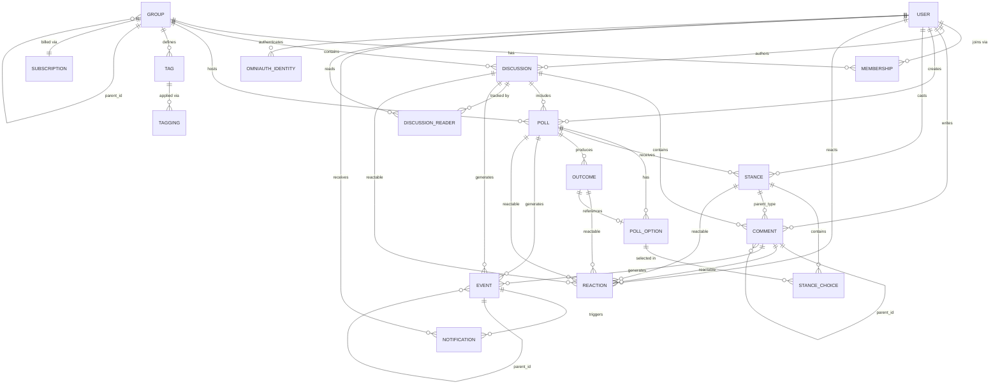

# Loomio Database Schema Investigation

> Deep analysis of the PostgreSQL schema from `schema_dump.sql` for Go rewrite planning.
> Generated: 2026-01-30

## Table of Contents

1. [PostgreSQL Extensions](#1-postgresql-extensions)
2. [Table Inventory](#2-table-inventory)
3. [Data Type Patterns](#3-data-type-patterns)
4. [Soft Delete & State Patterns](#4-soft-delete--state-patterns)
5. [Counter Cache Analysis](#5-counter-cache-analysis)
6. [Index Strategy Analysis](#6-index-strategy-analysis)
7. [Foreign Key Relationships](#7-foreign-key-relationships)
8. [JSONB Schema Patterns](#8-jsonb-schema-patterns)
9. [Full-Text Search](#9-full-text-search)
10. [Go Migration Considerations](#10-go-migration-considerations)
11. [JSONB Field Structures (Detailed)](#11-jsonb-field-structures-detailed)
12. [Entity Relationship Diagram](#12-entity-relationship-diagram)
13. [Query Patterns](#13-query-patterns)

---

## 1. PostgreSQL Extensions

The schema requires four PostgreSQL extensions:

| Extension | Purpose | Go Implications |
|-----------|---------|-----------------|
| `citext` | Case-insensitive text for email, handles, tag names | Use `LOWER()` in queries or custom collation |
| `hstore` | Key-value pairs for translations, email headers | Map to `map[string]string` or custom type |
| `pg_stat_statements` | Query performance monitoring | Optional for production |
| `pgcrypto` | UUID generation via `gen_random_uuid()` | Use `github.com/google/uuid` or DB-generated |

**citext Usage:**
- `users.email` - Case-insensitive email matching
- `groups.handle` - Case-insensitive URL slugs
- `tags.name` - Case-insensitive tag names
- `forward_email_rules.handle`
- `member_email_aliases.email`

**hstore Usage:**
- `translations.fields` - Translated field key-value pairs
- `received_emails.headers` - Email headers

---

## 2. Table Inventory

### 2.1 Core Domain Tables (13)

| Table | Primary Key | Notable Columns | Lines in Dump |
|-------|-------------|-----------------|---------------|
| `users` | `id` (serial) | citext email, secret_token (UUID default) | 2278-2345 |
| `groups` | `id` (serial) | parent_id (self-ref), citext handle | 1072-1147 |
| `memberships` | `id` (serial) | admin, delegate, volume | 1286-1305 |
| `discussions` | `id` (serial) | key (unique), tags[], private | 808-847 |
| `comments` | `id` (serial) | parent_type, polymorphic | 590-609 |
| `polls` | `id` (serial) | poll_type, anonymous, hide_results | 1735-1790 |
| `poll_options` | `id` (serial) | voter_scores JSONB | 1617-1634 |
| `stances` | `id` (serial) | option_scores JSONB, latest bool | 1967-1991 |
| `stance_choices` | `id` (serial) | score | 1898-1905 |
| `outcomes` | `id` (serial) | statement, poll_option_id | 1524-1540 |
| `events` | `id` (serial) | kind, position_key, depth | 918-938 |
| `notifications` | `id` (serial) | event_id, viewed | 1332-1342 |
| `tags` | `id` (serial) | citext name, color | 2101-2111 |

### 2.2 Access Control Tables (6)

| Table | Purpose |
|-------|---------|
| `discussion_readers` | Discussion access + read tracking |
| `membership_requests` | Pending group join requests |
| `login_tokens` | Passwordless authentication |
| `omniauth_identities` | OAuth/SAML connections |
| `group_identities` | Group-level OAuth |
| `member_email_aliases` | Email alias verification |

### 2.3 Template Tables (2)

| Table | Purpose |
|-------|---------|
| `discussion_templates` | Reusable discussion formats |
| `poll_templates` | Reusable poll configurations |

### 2.4 Content Tables (5)

| Table | Purpose |
|-------|---------|
| `documents` | Legacy file attachments |
| `attachments` | Legacy comment attachments |
| `taggings` | Polymorphic tag assignments |
| `reactions` | Emoji reactions (polymorphic) |
| `translations` | Content translations |

### 2.5 Task System (2)

| Table | Purpose |
|-------|---------|
| `tasks` | Todo items (polymorphic record) |
| `tasks_users` | Task assignee many-to-many |

### 2.6 Integration Tables (4)

| Table | Purpose |
|-------|---------|
| `webhooks` | Outgoing webhook configurations |
| `chatbots` | Chat platform integrations |
| `received_emails` | Inbound email processing |
| `forward_email_rules` | Email forwarding rules |

### 2.7 Subscription/Billing (2)

| Table | Purpose |
|-------|---------|
| `subscriptions` | Plan and billing state |
| `group_surveys` | Onboarding surveys |

### 2.8 Audit/Admin Tables (3)

| Table | Purpose |
|-------|---------|
| `versions` | PaperTrail audit log |
| `active_admin_comments` | Admin interface notes |
| `user_deactivation_responses` | Exit survey responses |

### 2.9 Search (1)

| Table | Purpose |
|-------|---------|
| `pg_search_documents` | Full-text search index |

### 2.10 Analytics (5)

| Table | Purpose |
|-------|---------|
| `blazer_queries` | Saved SQL queries |
| `blazer_dashboards` | Query dashboards |
| `blazer_dashboard_queries` | Dashboard-query join |
| `blazer_checks` | Scheduled query checks |
| `blazer_audits` | Query execution log |

### 2.11 Rails Infrastructure (5)

| Table | Purpose |
|-------|---------|
| `active_storage_blobs` | File metadata |
| `active_storage_attachments` | File associations |
| `active_storage_variant_records` | Image variants |
| `action_mailbox_inbound_emails` | Inbound email tracking |
| `ar_internal_metadata` | Rails metadata |

### 2.12 Other (6)

| Table | Purpose |
|-------|---------|
| `blocked_domains` | Email domain blocklist |
| `demos` | Demo group templates |
| `cohorts` | User cohort tracking |
| `default_group_covers` | Default cover images |
| `partition_sequences` | Custom sequence management |
| `schema_migrations` | Rails migration tracking |

### 2.13 OAuth Provider Tables (3)

| Table | Purpose |
|-------|---------|
| `oauth_applications` | OAuth client apps |
| `oauth_access_tokens` | Active tokens |
| `oauth_access_grants` | Authorization grants |

---

## 3. Data Type Patterns

### 3.1 Text Format Fields

Many content fields have paired `*_format` columns:

| Field | Format Column | Values |
|-------|---------------|--------|
| `discussions.description` | `description_format` | `'md'`, `'html'` |
| `comments.body` | `body_format` | `'md'`, `'html'` |
| `polls.details` | `details_format` | `'md'`, `'html'` |
| `outcomes.statement` | `statement_format` | `'md'`, `'html'` |
| `stances.reason` | `reason_format` | `'md'`, `'html'` |
| `users.short_bio` | `short_bio_format` | `'md'`, `'html'` |
| `groups.description` | `description_format` | `'md'`, `'html'` |

**Go Pattern:**
```go
type RichText struct {
    Content string
    Format  string // "md" or "html"
}
```

### 3.2 Volume/Notification Levels

Integer enum for notification frequency:

| Table | Column | Default |
|-------|--------|---------|
| `discussion_readers` | `volume` | 2 |
| `memberships` | `volume` | nullable |
| `stances` | `volume` | 2 |
| `users` | `default_membership_volume` | 2 |

Values appear to be: 0=mute, 1=quiet, 2=normal, 3=loud (based on Rails code).

### 3.3 Boolean Permission Flags

Groups table has many permission flags:

```sql
members_can_add_members boolean DEFAULT false
members_can_edit_discussions boolean DEFAULT true
members_can_edit_comments boolean DEFAULT true
members_can_raise_motions boolean DEFAULT true
members_can_vote boolean DEFAULT true
members_can_start_discussions boolean DEFAULT true
members_can_create_subgroups boolean DEFAULT false
members_can_announce boolean DEFAULT true
members_can_add_guests boolean DEFAULT true
members_can_delete_comments boolean DEFAULT true
admins_can_edit_user_content boolean DEFAULT true
can_start_polls_without_discussion boolean DEFAULT false
```

### 3.4 Token Columns

Multiple tables use token columns for guest/invite access:

| Table | Token Column | Usage |
|-------|--------------|-------|
| `users` | `secret_token` | WebSocket auth (UUID default) |
| `users` | `authentication_token` | API auth |
| `users` | `unsubscribe_token` | Email unsubscribe |
| `users` | `remember_token` | Session persistence |
| `memberships` | `token` | Invite token |
| `discussion_readers` | `token` | Guest access |
| `stances` | `token` | Guest voting |
| `groups` | `token` | Group share token |
| `login_tokens` | `token` | Passwordless auth |
| `webhooks` | `token` | Webhook auth |

### 3.5 Array Columns

PostgreSQL arrays used for denormalized tags:

```sql
discussions.tags character varying[] DEFAULT '{}'
polls.tags character varying[] DEFAULT '{}'
discussion_templates.tags character varying[] DEFAULT '{}'
poll_templates.tags character varying[] DEFAULT '{}'
chatbots.event_kinds character varying[]
webhooks.permissions character varying[] DEFAULT '{}'
```

**Indexed with GIN:**
```sql
CREATE INDEX index_discussions_on_tags ON discussions USING gin (tags);
CREATE INDEX index_polls_on_tags ON polls USING gin (tags);
```

---

## 4. Soft Delete & State Patterns

### 4.1 Soft Delete Fields

| Table | Field | Purpose |
|-------|-------|---------|
| `discussions` | `discarded_at`, `discarded_by` | Soft delete |
| `comments` | `discarded_at`, `discarded_by` | Soft delete |
| `polls` | `discarded_at`, `discarded_by` | Soft delete |
| `tasks` | `discarded_at` | Soft delete |
| `discussion_templates` | `discarded_at`, `discarded_by` | Soft delete |
| `poll_templates` | `discarded_at` | Soft delete |
| `groups` | `archived_at` | Archive (not delete) |
| `users` | `deactivated_at`, `deactivator_id` | Deactivation |

### 4.2 Access Revocation

| Table | Field | Purpose |
|-------|-------|---------|
| `memberships` | `revoked_at`, `revoker_id` | Membership removal |
| `discussion_readers` | `revoked_at`, `revoker_id` | Access removal |
| `stances` | `revoked_at`, `revoker_id` | Vote revocation |

### 4.3 Partial Indexes for Soft Deletes

```sql
CREATE INDEX index_discussions_on_discarded_at
    ON discussions (discarded_at) WHERE discarded_at IS NULL;

CREATE INDEX index_groups_on_archived_at
    ON groups (archived_at) WHERE archived_at IS NULL;
```

### 4.4 Poll State Fields

| Field | Type | Purpose |
|-------|------|---------|
| `closing_at` | timestamp | Scheduled close time |
| `closed_at` | timestamp | Actual close time |

Active poll: `closed_at IS NULL AND (closing_at IS NULL OR closing_at > NOW())`

---

## 5. Counter Cache Analysis

### 5.1 User Counters

```sql
users.memberships_count integer DEFAULT 0
users.complaints_count integer DEFAULT 0
```

### 5.2 Group Counters

```sql
groups.memberships_count integer DEFAULT 0
groups.admin_memberships_count integer DEFAULT 0
groups.pending_memberships_count integer DEFAULT 0
groups.discussions_count integer DEFAULT 0
groups.public_discussions_count integer DEFAULT 0
groups.open_discussions_count integer DEFAULT 0
groups.closed_discussions_count integer DEFAULT 0
groups.polls_count integer DEFAULT 0
groups.closed_polls_count integer DEFAULT 0
groups.closed_motions_count integer DEFAULT 0
groups.proposal_outcomes_count integer DEFAULT 0
groups.subgroups_count integer DEFAULT 0
groups.invitations_count integer DEFAULT 0
groups.recent_activity_count integer DEFAULT 0
groups.discussion_templates_count integer DEFAULT 0
groups.poll_templates_count integer DEFAULT 0
groups.delegates_count integer DEFAULT 0
```

### 5.3 Discussion Counters

```sql
discussions.items_count integer DEFAULT 0
discussions.closed_polls_count integer DEFAULT 0
discussions.anonymous_polls_count integer DEFAULT 0
discussions.seen_by_count integer DEFAULT 0
discussions.members_count integer
```

### 5.4 Poll Counters

```sql
polls.voters_count integer DEFAULT 0
polls.undecided_voters_count integer DEFAULT 0
polls.none_of_the_above_count integer DEFAULT 0
```

### 5.5 Content Counters

```sql
comments.comment_votes_count integer DEFAULT 0
comments.attachments_count integer DEFAULT 0
comments.versions_count integer DEFAULT 0
tags.taggings_count integer DEFAULT 0
tags.org_taggings_count integer DEFAULT 0
poll_options.voter_count integer DEFAULT 0
poll_options.total_score integer DEFAULT 0
```

### 5.6 Version Counters

```sql
discussions.versions_count integer DEFAULT 0
polls.versions_count integer DEFAULT 0
outcomes.versions_count integer DEFAULT 0
stances.versions_count integer DEFAULT 0
```

---

## 6. Index Strategy Analysis

### 6.1 Unique Indexes

| Table | Columns | Notes |
|-------|---------|-------|
| `users` | `email` | citext, case-insensitive |
| `users` | `username` | |
| `users` | `key` | URL key |
| `users` | `reset_password_token` | |
| `users` | `unsubscribe_token` | |
| `users` | `unlock_token` | |
| `groups` | `handle` | citext |
| `groups` | `key` | URL key |
| `groups` | `token` | |
| `discussions` | `key` | URL key |
| `polls` | `key` | URL key |
| `memberships` | `(group_id, user_id)` | |
| `memberships` | `token` | |
| `discussion_readers` | `(user_id, discussion_id)` | |
| `discussion_readers` | `token` | |
| `stances` | `(poll_id, participant_id, latest)` | Partial: WHERE latest = true |
| `stances` | `token` | |
| `events` | `(discussion_id, sequence_id)` | |
| `tags` | `(group_id, name)` | |
| `blocked_domains` | `name` | |

### 6.2 Partial Indexes

```sql
-- Soft delete optimization
CREATE INDEX index_discussions_on_discarded_at
    ON discussions (discarded_at) WHERE discarded_at IS NULL;

CREATE INDEX index_groups_on_archived_at
    ON groups (archived_at) WHERE archived_at IS NULL;

-- Latest stance per user per poll
CREATE UNIQUE INDEX index_stances_on_poll_id_and_participant_id_and_latest
    ON stances (poll_id, participant_id, latest) WHERE latest = true;

-- Guest filtering
CREATE INDEX discussion_readers_guests
    ON discussion_readers (guest) WHERE guest = true;

CREATE INDEX stances_guests
    ON stances (guest) WHERE guest = true;

-- Template discussions
CREATE INDEX index_discussions_on_template
    ON discussions (template) WHERE template IS TRUE;

-- Events with discussions
CREATE INDEX index_events_on_parent_id_and_discussion_id
    ON events (parent_id, discussion_id) WHERE discussion_id IS NOT NULL;
```

### 6.3 GIN Indexes (Arrays/JSONB)

```sql
CREATE INDEX index_discussions_on_tags ON discussions USING gin (tags);
CREATE INDEX index_polls_on_tags ON polls USING gin (tags);
CREATE INDEX pg_search_documents_searchable_index ON pg_search_documents USING gin (ts_content);
```

### 6.4 Composite Indexes for Common Queries

```sql
-- Notification lookup
CREATE INDEX notifications_user_id_id_idx ON notifications (user_id, id);

-- Poll status queries
CREATE INDEX index_polls_on_closed_at_and_closing_at ON polls (closed_at, closing_at);
CREATE INDEX index_polls_on_closed_at_and_discussion_id ON polls (closed_at, discussion_id);

-- Membership queries
CREATE INDEX index_memberships_on_user_id_and_volume ON memberships (user_id, volume);

-- Stance voting queries
CREATE INDEX index_stances_on_poll_id_and_cast_at ON stances (poll_id NULLS FIRST, cast_at NULLS FIRST);

-- Discussion timeline
CREATE INDEX index_discussions_on_last_activity_at ON discussions (last_activity_at DESC);
```

---

## 7. Foreign Key Relationships

### 7.1 Explicit Foreign Keys

The schema has minimal explicit foreign key constraints:

```sql
-- Only ActiveStorage constraints
ALTER TABLE active_storage_variant_records
    ADD CONSTRAINT fk_rails_993965df05
    FOREIGN KEY (blob_id) REFERENCES active_storage_blobs(id);

ALTER TABLE active_storage_attachments
    ADD CONSTRAINT fk_rails_c3b3935057
    FOREIGN KEY (blob_id) REFERENCES active_storage_blobs(id);
```

### 7.2 Implicit Relationships (Application-Enforced)

**User relationships:**
- `memberships.user_id` → `users.id`
- `discussions.author_id` → `users.id`
- `comments.user_id` → `users.id`
- `polls.author_id` → `users.id`
- `stances.participant_id` → `users.id`

**Group relationships:**
- `groups.parent_id` → `groups.id` (self-referential)
- `discussions.group_id` → `groups.id`
- `polls.group_id` → `groups.id`
- `memberships.group_id` → `groups.id`

**Discussion relationships:**
- `comments.discussion_id` → `discussions.id`
- `polls.discussion_id` → `discussions.id`
- `events.discussion_id` → `discussions.id`

**Poll relationships:**
- `poll_options.poll_id` → `polls.id`
- `stances.poll_id` → `polls.id`
- `outcomes.poll_id` → `polls.id`

### 7.3 Polymorphic Relationships

| Table | Type Column | ID Column | Types |
|-------|-------------|-----------|-------|
| `events` | `eventable_type` | `eventable_id` | Discussion, Comment, Poll, Stance, Outcome, Membership |
| `comments` | `parent_type` | `parent_id` | Discussion, Comment, Stance |
| `reactions` | `reactable_type` | `reactable_id` | Comment, Discussion, Poll, Stance |
| `documents` | `model_type` | `model_id` | Discussion, Group, Poll, Comment |
| `taggings` | `taggable_type` | `taggable_id` | Discussion, Poll |
| `translations` | `translatable_type` | `translatable_id` | Discussion, Comment, Poll |
| `tasks` | `record_type` | `record_id` | Discussion, Comment |
| `active_admin_comments` | `resource_type` | `resource_id` | Various |
| `active_storage_attachments` | `record_type` | `record_id` | Various |

---

## 8. JSONB Schema Patterns

### 8.1 Attachments Pattern

Used across multiple tables for file references:

```sql
-- Default: '[]'::jsonb
discussions.attachments jsonb DEFAULT '[]'::jsonb
comments.attachments jsonb DEFAULT '[]'::jsonb
polls.attachments jsonb DEFAULT '[]'::jsonb
outcomes.attachments jsonb DEFAULT '[]'::jsonb
stances.attachments jsonb DEFAULT '[]'::jsonb
users.attachments jsonb DEFAULT '[]'::jsonb
groups.attachments jsonb DEFAULT '[]'::jsonb
discussion_templates.attachments jsonb DEFAULT '[]'::jsonb
```

Likely structure: `[{signed_id, filename, content_type, byte_size}]`

### 8.2 Link Previews Pattern

```sql
discussions.link_previews jsonb DEFAULT '[]'::jsonb
comments.link_previews jsonb DEFAULT '[]'::jsonb
polls.link_previews jsonb DEFAULT '[]'::jsonb
outcomes.link_previews jsonb DEFAULT '[]'::jsonb
stances.link_previews jsonb DEFAULT '[]'::jsonb
users.link_previews jsonb DEFAULT '[]'::jsonb
groups.link_previews jsonb DEFAULT '[]'::jsonb
```

Likely structure: `[{url, title, description, image_url}]`

### 8.3 Poll Voting Data

```sql
polls.stance_data jsonb DEFAULT '{}'::jsonb
polls.stance_counts jsonb DEFAULT '[]'::jsonb
polls.matrix_counts jsonb DEFAULT '[]'::jsonb

poll_options.score_counts jsonb DEFAULT '{}'::jsonb
poll_options.voter_scores jsonb DEFAULT '{}'::jsonb

stances.option_scores jsonb DEFAULT '{}'::jsonb
```

`stance_counts`: `[{option_id: count}]` for quick result display
`voter_scores`: `{user_id: score}` for detailed vote tracking
`option_scores`: `{poll_option_id: score}` for stance choices

### 8.4 Custom Fields / Experiences

```sql
users.experiences jsonb DEFAULT '{}'::jsonb
memberships.experiences jsonb DEFAULT '{}'::jsonb
events.custom_fields jsonb DEFAULT '{}'::jsonb
outcomes.custom_fields jsonb DEFAULT '{}'::jsonb
polls.custom_fields jsonb DEFAULT '{}'::jsonb
omniauth_identities.custom_fields jsonb DEFAULT '{}'::jsonb
group_identities.custom_fields jsonb DEFAULT '{}'::jsonb
```

Used for feature flags, user preferences, event metadata.

### 8.5 Info Fields

```sql
discussions.info jsonb DEFAULT '{}'::jsonb
groups.info jsonb DEFAULT '{}'::jsonb
subscriptions.info jsonb
```

Extensible metadata storage.

### 8.6 Webhook/Chatbot Event Kinds

```sql
webhooks.event_kinds jsonb DEFAULT '[]'::jsonb
chatbots.event_kinds character varying[]  -- Note: array, not jsonb
```

Event kinds to subscribe to (e.g., `new_discussion`, `poll_closed`).

### 8.7 Notification Translation Values

```sql
notifications.translation_values jsonb DEFAULT '{}'::jsonb
```

Variables for notification message interpolation.

### 8.8 Poll Template Options

```sql
poll_templates.poll_options jsonb DEFAULT '[]'::jsonb
```

Pre-configured poll options for templates.

---

## 9. Full-Text Search

### 9.1 Search Document Table

```sql
CREATE TABLE pg_search_documents (
    id bigint NOT NULL,
    content text,                    -- Searchable content
    ts_content tsvector,             -- Pre-computed tsvector
    author_id bigint,                -- Filter by author
    group_id bigint,                 -- Filter by group
    discussion_id bigint,            -- Filter by discussion
    poll_id bigint,                  -- Filter by poll
    searchable_type character varying,  -- Source type
    searchable_id bigint,            -- Source ID
    created_at timestamp NOT NULL,
    updated_at timestamp NOT NULL,
    authored_at timestamp            -- Original creation time
);
```

### 9.2 Search Indexes

```sql
-- GIN index for full-text search
CREATE INDEX pg_search_documents_searchable_index
    ON pg_search_documents USING gin (ts_content);

-- Filter indexes
CREATE INDEX index_pg_search_documents_on_author_id ON pg_search_documents (author_id);
CREATE INDEX index_pg_search_documents_on_group_id ON pg_search_documents (group_id);
CREATE INDEX index_pg_search_documents_on_discussion_id ON pg_search_documents (discussion_id);
CREATE INDEX index_pg_search_documents_on_poll_id ON pg_search_documents (poll_id);

-- Sort indexes
CREATE INDEX pg_search_documents_authored_at_asc_index ON pg_search_documents (authored_at);
CREATE INDEX pg_search_documents_authored_at_desc_index ON pg_search_documents (authored_at DESC);
```

### 9.3 Go Integration Notes

For Go, consider:
- Use `pgx` with native tsvector support
- Or use PostgreSQL's `to_tsvector()` and `plainto_tsquery()` functions
- Keep the dedicated search document table for performance

---

## 10. Go Migration Considerations

### 10.1 Type Mappings

| PostgreSQL | Go Type | Notes |
|------------|---------|-------|
| `serial`/`integer` | `int32` or `int64` | Prefer `int64` for IDs |
| `bigint` | `int64` | |
| `character varying(N)` | `string` | |
| `text` | `string` | |
| `boolean` | `bool` | |
| `timestamp` | `time.Time` | Use `*time.Time` for nullable |
| `date` | `time.Time` | Or use `civil.Date` |
| `inet` | `netip.Addr` | Go 1.18+ |
| `jsonb` | Custom struct or `map[string]any` | |
| `character varying[]` | `[]string` | |
| `citext` | `string` | Handle in queries |
| `hstore` | `map[string]string` | |
| `tsvector` | `string` or custom | |

### 10.2 GORM Model Patterns

```go
// Soft delete with discard pattern
type DiscardedAt struct {
    DiscardedAt *time.Time `gorm:"index"`
    DiscardedBy *int64
}

// Revocable access pattern
type Revocable struct {
    RevokedAt *time.Time
    RevokerID *int64
}

// Rich text pattern
type RichText struct {
    Content string
    Format  string // "md" or "html"
}

// Polymorphic pattern
type Polymorphic struct {
    RecordType string
    RecordID   int64
}
```

### 10.3 Counter Cache Strategy

Options for Go:
1. **Database triggers** - Most reliable, schema-defined
2. **Application-level** - Use transactions with explicit updates
3. **Eventual consistency** - Background jobs reconcile counts

### 10.4 Unique Constraint Handling

Implement proper error handling for constraint violations:

```go
// Check for unique constraint violation
if pgErr, ok := err.(*pgconn.PgError); ok {
    if pgErr.Code == "23505" { // unique_violation
        return ErrDuplicate
    }
}
```

### 10.5 citext Handling

Options:
1. Use `LOWER()` in queries: `WHERE LOWER(email) = LOWER($1)`
2. Create custom collation
3. Handle at application level with string normalization

### 10.6 Partial Index Queries

Ensure queries match partial index conditions:

```go
// This will use the partial index
db.Where("discarded_at IS NULL").Where("group_id = ?", groupID)

// This won't (wrong condition)
db.Where("group_id = ?", groupID)
```

### 10.7 Array Queries

```sql
-- Contains any
WHERE tags && ARRAY['tag1', 'tag2']

-- Contains all
WHERE tags @> ARRAY['tag1', 'tag2']
```

### 10.8 JSONB Queries

```sql
-- Access nested field
WHERE (custom_fields->>'some_key')::boolean = true

-- Array contains
WHERE attachments @> '[{"signed_id": "abc"}]'
```

---

## Appendix A: Table Statistics

| Category | Count |
|----------|-------|
| Core domain tables | 13 |
| Access control tables | 6 |
| Template tables | 2 |
| Content/attachment tables | 5 |
| Task system tables | 2 |
| Integration tables | 4 |
| Subscription tables | 2 |
| Audit/admin tables | 3 |
| Search tables | 1 |
| Analytics tables | 5 |
| Rails infrastructure | 5 |
| OAuth provider tables | 3 |
| Other tables | 6 |
| **Total** | **57** |

## Appendix B: Key Unique Constraints Summary

| Purpose | Table(s) | Columns |
|---------|----------|---------|
| User identity | users | email, username, key |
| Group identity | groups | handle, key |
| Content URLs | discussions, polls | key |
| Membership uniqueness | memberships | (group_id, user_id) |
| Reader uniqueness | discussion_readers | (user_id, discussion_id) |
| Latest stance | stances | (poll_id, participant_id, latest) WHERE latest=true |
| Tag uniqueness | tags | (group_id, name) |
| Event sequence | events | (discussion_id, sequence_id) |

---

## 11. JSONB Field Structures (Detailed)

This section provides exact JSONB structures based on analysis of Rails serializers and models.

### 11.1 Attachments

**Tables:** discussions, comments, polls, outcomes, stances, users, groups, poll_templates

**Structure:** Array of attachment objects (linked to ActiveStorage)
```typescript
type Attachment = {
  signed_id: string;      // ActiveStorage blob signed ID
  filename: string;
  content_type: string;
  byte_size: number;
}
```

**Go Type:**
```go
type Attachment struct {
    SignedID    string `json:"signed_id"`
    Filename    string `json:"filename"`
    ContentType string `json:"content_type"`
    ByteSize    int64  `json:"byte_size"`
}
```

### 11.2 Link Previews

**Tables:** comments, discussions, polls, groups, users, stances, outcomes, poll_templates

**Structure:** Array of link preview objects
```typescript
type LinkPreview = {
  title: string;
  url: string;
  description: string;
  image: string;        // Image URL
  hostname: string;
}
```

**Example (from factories):**
```json
[{
  "title": "link title",
  "url": "https://www.example.com",
  "description": "a link to a page",
  "image": "https://www.loomio.org/theme/logo.svg",
  "hostname": "www.example.com"
}]
```

**Go Type:**
```go
type LinkPreview struct {
    Title       string `json:"title"`
    URL         string `json:"url"`
    Description string `json:"description"`
    Image       string `json:"image"`
    Hostname    string `json:"hostname"`
}
```

### 11.3 Stance Counts (polls)

**Structure:** Array of integers representing vote counts per option (ordered by option priority)

**Example:**
```json
[1, 0]    // 1 vote for first option, 0 for second
[1, 1]    // 1 vote for each option
```

**Go Type:**
```go
type Poll struct {
    StanceCounts []int `json:"stance_counts"`
}
```

### 11.4 Option Scores (stances)

**Structure:** Object mapping poll_option_id (string key) to score value

**Example:**
```json
{"123": 5, "124": 3}   // option 123 scored 5, option 124 scored 3
```

**Access in Rails:**
```ruby
def score_for(option)
  option_scores[option.id] || 0
end
```

**Go Type:**
```go
type Stance struct {
    OptionScores map[string]int `json:"option_scores"`
}

func (s *Stance) ScoreFor(optionID int64) int {
    return s.OptionScores[strconv.FormatInt(optionID, 10)]
}
```

### 11.5 Voter Scores (poll_options)

**Structure:** Object mapping user_id to their score for this option

**Example:**
```json
{"1": 5, "2": 3, "15": 4}   // user 1 gave 5, user 2 gave 3, etc.
```

**Access in Rails:**
```ruby
def voter_ids
  voter_scores.filter { |id, score| score != 0 }.keys.map(&:to_i)
end
```

**Note:** Set to empty `{}` for anonymous polls.

**Go Type:**
```go
type PollOption struct {
    VoterScores map[string]int `json:"voter_scores"`
}

func (po *PollOption) VoterIDs() []int64 {
    var ids []int64
    for id, score := range po.VoterScores {
        if score != 0 {
            if i, err := strconv.ParseInt(id, 10, 64); err == nil {
                ids = append(ids, i)
            }
        }
    }
    return ids
}
```

### 11.6 Experiences (users, memberships)

**Structure:** Object storing user interaction history and preferences

**Example keys:**
- `"html-editor.uses-markdown"` - boolean tracking user preference

**Access in Rails:**
```ruby
def default_format
  if experiences['html-editor.uses-markdown']
    'md'
  else
    'html'
  end
end

def experienced!(key, toggle = true)
  experiences[key] = toggle
  save
end
```

**Go Type:**
```go
type Experiences map[string]any

func (e Experiences) UsesMarkdown() bool {
    if v, ok := e["html-editor.uses-markdown"].(bool); ok {
        return v
    }
    return false
}
```

### 11.7 Custom Fields (polls, outcomes, events)

**Structure:** Defined via `set_custom_fields` macro with typed accessors

**On Polls:**
- `meeting_duration` (int) - for meeting polls
- `time_zone` (string) - timezone for meeting times
- `can_respond_maybe` (bool) - whether "maybe" responses allowed

**On Outcomes:**
- `event_summary` (string)
- `event_description` (string)
- `event_location` (string)

**On Events:**
- `pinned_title` (string)
- `recipient_user_ids` ([]int)
- `recipient_chatbot_ids` ([]int)
- `recipient_message` (string)
- `recipient_audience` (string)
- `stance_ids` ([]int)

**Go Pattern:**
```go
type PollCustomFields struct {
    MeetingDuration  *int    `json:"meeting_duration,omitempty"`
    TimeZone         *string `json:"time_zone,omitempty"`
    CanRespondMaybe  *bool   `json:"can_respond_maybe,omitempty"`
}

type Poll struct {
    CustomFields PollCustomFields `json:"custom_fields"`
}
```

### 11.8 Poll Options (poll_templates)

**Structure:** Array of option objects for template configuration

**Fields per option:**
- `name` (required) - option text
- `meaning` (optional) - semantic meaning
- `prompt` (optional) - user-facing prompt
- `icon` (optional) - icon identifier

**Example:**
```json
[
  {"name": "agree", "meaning": "support", "icon": "thumb-up"},
  {"name": "disagree", "meaning": "oppose", "icon": "thumb-down"},
  {"name": "abstain", "meaning": "neutral"}
]
```

**Go Type:**
```go
type PollTemplateOption struct {
    Name    string  `json:"name"`
    Meaning *string `json:"meaning,omitempty"`
    Prompt  *string `json:"prompt,omitempty"`
    Icon    *string `json:"icon,omitempty"`
}
```

### 11.9 Info Fields

**On Subscriptions:** Stores Chargify integration data
```json
{"chargify_management_link": "https://..."}
```

**On Groups/Discussions:** General extensible metadata

---

## 12. Entity Relationship Diagram

### 12.1 Mermaid ER Diagram



### 12.2 Core Domain Relationships

**User ↔ Group (Many-to-Many via Membership):**
```
User ──┬── Membership ──┬── Group
       │                │
       │ user_id        │ group_id
       │ admin          │ parent_id (self-ref)
       │ delegate       │
       │ volume         │
       │ revoked_at     │
```

**Group Hierarchy (Self-Referential):**
```
Organization (Group)
├── Subgroup A (parent_id = org.id)
│   └── Sub-subgroup (parent_id = A.id)
└── Subgroup B (parent_id = org.id)
```

**Discussion Thread Structure:**
```
Discussion
├── Comment (parent_type: Discussion)
│   └── Comment (parent_type: Comment, parent_id = parent.id)
├── Poll
│   └── Stance
│       └── Comment (parent_type: Stance)
└── Event (timeline)
```

**Poll Voting Flow:**
```
Poll
├── PollOption (options to vote on)
│   ├── voter_scores: {user_id: score}
│   └── total_score, voter_count
└── Stance (one per participant, latest=true)
    ├── option_scores: {poll_option_id: score}
    └── StanceChoice (detailed selection)
        └── poll_option_id, score
```

### 12.3 Polymorphic Relationships

| Polymorphic Entity | Type Column | Eventable Types |
|-------------------|-------------|-----------------|
| **Event** | `eventable_type` | Discussion, Comment, Poll, Stance, Outcome, Membership |
| **Comment** | `parent_type` | Discussion, Comment, Stance |
| **Reaction** | `reactable_type` | Discussion, Comment, Poll, Stance, Outcome |
| **Document** | `model_type` | Discussion, Group, Poll, Comment |
| **Tagging** | `taggable_type` | Discussion, Poll |
| **Task** | `record_type` | Discussion, Comment |

### 12.4 Access Control Layer

```
User
├── Membership (group access)
│   ├── admin: bool
│   ├── delegate: bool
│   └── revoked_at: nullable
├── DiscussionReader (discussion access)
│   ├── guest: bool
│   ├── admin: bool
│   ├── token: for guest access
│   └── revoked_at: nullable
└── Stance (poll access)
    ├── guest: bool
    ├── admin: bool
    ├── token: for guest voting
    └── revoked_at: nullable
```

---

## 13. Query Patterns

### 13.1 Discussion Visibility

**Pattern:** Complex visibility based on membership, guest access, and privacy settings

**Ruby/ActiveRecord:**
```ruby
DiscussionQuery.visible_to(user: current_user, or_public: true)
  .joins("LEFT OUTER JOIN discussion_readers dr ON
          dr.discussion_id = discussions.id AND
          (dr.user_id = #{user.id} OR dr.token = '#{token}')")
  .where("(discussions.private = false) OR
          (discussions.group_id IN (:group_ids)) OR
          (dr.id IS NOT NULL AND dr.revoked_at IS NULL)")
```

**Equivalent SQL:**
```sql
SELECT DISTINCT discussions.*
FROM discussions
LEFT JOIN groups ON discussions.group_id = groups.id
LEFT JOIN discussion_readers dr ON dr.discussion_id = discussions.id
  AND (dr.user_id = $1 OR dr.token = $2)
WHERE groups.archived_at IS NULL
  AND discussions.discarded_at IS NULL
  AND (
    discussions.private = FALSE
    OR discussions.group_id IN ($3)
    OR (dr.id IS NOT NULL AND dr.revoked_at IS NULL AND dr.guest = TRUE)
  )
ORDER BY discussions.last_activity_at DESC
```

**Go Implementation:**
```go
func (q *DiscussionQuery) VisibleTo(userID int64, groupIDs []int64) *gorm.DB {
    return q.db.
        Joins("LEFT JOIN groups ON discussions.group_id = groups.id").
        Joins("LEFT JOIN discussion_readers dr ON dr.discussion_id = discussions.id AND dr.user_id = ?", userID).
        Where("groups.archived_at IS NULL").
        Where("discussions.discarded_at IS NULL").
        Where("discussions.private = FALSE OR discussions.group_id IN ? OR (dr.id IS NOT NULL AND dr.revoked_at IS NULL)", groupIDs)
}
```

### 13.2 Poll Status Queries

**Ruby scopes:**
```ruby
scope :active, -> { kept.where('polls.closed_at': nil) }
scope :closed, -> { kept.where("polls.closed_at IS NOT NULL") }
scope :lapsed_but_not_closed, -> { active.where("polls.closing_at < ?", Time.now) }
```

**SQL:**
```sql
-- Active polls
SELECT * FROM polls
WHERE discarded_at IS NULL AND closed_at IS NULL

-- Closing soon (within 24 hours)
SELECT * FROM polls
WHERE discarded_at IS NULL
  AND closed_at IS NULL
  AND closing_at BETWEEN NOW() AND NOW() + INTERVAL '24 hours'

-- Lapsed (should be closed)
SELECT * FROM polls
WHERE discarded_at IS NULL
  AND closed_at IS NULL
  AND closing_at < NOW()
```

**Supporting indexes:**
- `polls(closed_at, closing_at)`
- `polls(discarded_at)` partial

### 13.3 Latest Stance Per User

**Pattern:** One active stance per user per poll, tracked via `latest` boolean

**Ruby:**
```ruby
scope :latest, -> { where(latest: true, revoked_at: nil) }

# Reset latest flags
poll.stances.update_all(latest: false)
Stance.where("id IN (
  SELECT DISTINCT ON (participant_id) id FROM stances
  WHERE poll_id = ? ORDER BY participant_id, created_at DESC
)").update_all(latest: true)
```

**SQL:**
```sql
-- Get latest stances
SELECT * FROM stances
WHERE poll_id = $1 AND latest = TRUE AND revoked_at IS NULL

-- Undecided voters
SELECT users.* FROM users
JOIN stances ON stances.participant_id = users.id
WHERE stances.poll_id = $1
  AND stances.latest = TRUE
  AND stances.revoked_at IS NULL
  AND stances.cast_at IS NULL
```

**Supporting index:**
```sql
CREATE UNIQUE INDEX ON stances (poll_id, participant_id, latest)
WHERE latest = true;
```

### 13.4 Event Timeline/Sequence

**Pattern:** Events ordered by sequence_id within discussions, position_key for threading

**Ruby:**
```ruby
# Get next sequence ID
def next_sequence_id!
  val = Event.where(discussion_id: discussion_id)
             .where("sequence_id IS NOT NULL")
             .maximum(:sequence_id) || 0
  val + 1
end

# Position key format: "parent_key-position" (zero-padded)
event.position_key = [parent&.position_key, Event.zero_fill(position)].compact.join('-')
```

**SQL:**
```sql
-- Events in discussion order
SELECT * FROM events
WHERE discussion_id = $1
ORDER BY sequence_id ASC

-- Threaded view
SELECT * FROM events
WHERE discussion_id = $1
ORDER BY position_key ASC

-- Children of event
SELECT * FROM events
WHERE parent_id = $1
ORDER BY position ASC
```

**Supporting indexes:**
- `events(discussion_id, sequence_id)` unique
- `events(position_key)`
- `events(parent_id)`

### 13.5 Membership & Permission Checks

**Ruby:**
```ruby
scope :active, -> { where(revoked_at: nil) }
scope :admin, -> { where(admin: true) }

# Check user permission
user.memberships.active.where(group_id: group.id).exists?
user.memberships.active.admin.where(group_id: group.id).exists?
```

**SQL:**
```sql
-- Is user a member?
SELECT EXISTS(
  SELECT 1 FROM memberships
  WHERE user_id = $1 AND group_id = $2 AND revoked_at IS NULL
)

-- Is user an admin?
SELECT EXISTS(
  SELECT 1 FROM memberships
  WHERE user_id = $1 AND group_id = $2 AND revoked_at IS NULL AND admin = TRUE
)

-- Get user's group IDs
SELECT group_id FROM memberships
WHERE user_id = $1 AND revoked_at IS NULL
```

### 13.6 Soft Delete Pattern

**Pattern:** All queries must filter `discarded_at IS NULL`

**Ruby (via Discard gem):**
```ruby
include Discard::Model
default_scope { kept }  # WHERE discarded_at IS NULL
```

**Go Pattern:**
```go
func (r *DiscussionRepo) FindKept(ctx context.Context, id int64) (*Discussion, error) {
    var d Discussion
    err := r.db.Where("id = ? AND discarded_at IS NULL", id).First(&d).Error
    return &d, err
}

// Scope helper
func Kept(db *gorm.DB) *gorm.DB {
    return db.Where("discarded_at IS NULL")
}
```

### 13.7 Tag Array Queries

**Ruby:**
```ruby
scope :with_tags, ->(tags) { where("tags @> ARRAY[?]::varchar[]", tags) }
```

**SQL:**
```sql
-- Discussions with ALL specified tags
SELECT * FROM discussions
WHERE tags @> ARRAY['feature-request', 'urgent']::varchar[]

-- Discussions with ANY specified tags
SELECT * FROM discussions
WHERE tags && ARRAY['feature-request', 'urgent']::varchar[]
```

**Go (using pgx):**
```go
func (r *DiscussionRepo) WithTags(ctx context.Context, tags []string) ([]*Discussion, error) {
    var discussions []*Discussion
    err := r.db.Where("tags @> ?::varchar[]", pq.Array(tags)).Find(&discussions).Error
    return discussions, err
}
```

### 13.8 Full-Text Search

**Ruby:**
```ruby
# Reindex content
INSERT INTO pg_search_documents (searchable_type, searchable_id, content, ts_content, ...)
SELECT 'Discussion', discussions.id,
  regexp_replace(CONCAT_WS(' ', discussions.title, discussions.description, users.name), '<[^>]+>', '', 'gi'),
  to_tsvector('simple', ...)
FROM discussions
```

**SQL:**
```sql
-- Search with ranking
SELECT *, ts_rank(ts_content, query) AS rank
FROM pg_search_documents, plainto_tsquery('simple', $1) query
WHERE ts_content @@ query
  AND group_id = $2
ORDER BY rank DESC, authored_at DESC
LIMIT 50
```

### 13.9 Counter Cache Updates

**Pattern:** Increment/decrement on related record changes

**Ruby:**
```ruby
update_counter_cache :group, :discussions_count
update_counter_cache :group, :memberships_count
```

**SQL:**
```sql
-- After creating discussion
UPDATE groups
SET discussions_count = discussions_count + 1
WHERE id = $1

-- Reconciliation query
UPDATE groups SET discussions_count = (
  SELECT COUNT(*) FROM discussions
  WHERE group_id = groups.id AND discarded_at IS NULL
)
WHERE id = $1
```

**Go Pattern:**
```go
func (r *DiscussionRepo) Create(ctx context.Context, d *Discussion) error {
    return r.db.Transaction(func(tx *gorm.DB) error {
        if err := tx.Create(d).Error; err != nil {
            return err
        }
        return tx.Model(&Group{}).
            Where("id = ?", d.GroupID).
            UpdateColumn("discussions_count", gorm.Expr("discussions_count + 1")).
            Error
    })
}
```

### 13.10 Pagination Patterns

**Ruby:**
```ruby
scope :order_by_latest_activity, -> { order(last_activity_at: :desc) }
```

**SQL:**
```sql
SELECT * FROM discussions
WHERE group_id = $1 AND discarded_at IS NULL
ORDER BY pinned_at DESC NULLS LAST, last_activity_at DESC
LIMIT 50 OFFSET 0
```

**Go (cursor-based preferred):**
```go
func (r *DiscussionRepo) ListByActivity(groupID int64, after *time.Time, limit int) ([]*Discussion, error) {
    q := r.db.Where("group_id = ? AND discarded_at IS NULL", groupID)
    if after != nil {
        q = q.Where("last_activity_at < ?", after)
    }
    var discussions []*Discussion
    err := q.Order("last_activity_at DESC").Limit(limit).Find(&discussions).Error
    return discussions, err
}
```

---

## Appendix C: Go Type Definitions Summary

```go
// Core entities
type User struct {
    ID            int64
    Email         string  // citext
    Username      *string
    Name          string
    SecretToken   string  // UUID
    DeactivatedAt *time.Time
    Experiences   map[string]any
}

type Group struct {
    ID          int64
    ParentID    *int64  // self-referential
    Name        string
    Handle      string  // citext
    Key         string
    ArchivedAt  *time.Time
    // ... many boolean permission flags
}

type Discussion struct {
    ID           int64
    GroupID      int64
    AuthorID     int64
    Key          string
    Title        string
    Description  string
    Format       string  // "md" or "html"
    Private      bool
    Tags         []string
    DiscardedAt  *time.Time
    Attachments  []Attachment
    LinkPreviews []LinkPreview
}

type Poll struct {
    ID           int64
    AuthorID     int64
    GroupID      int64
    DiscussionID *int64
    Key          string
    Title        string
    PollType     string
    ClosingAt    *time.Time
    ClosedAt     *time.Time
    Anonymous    bool
    StanceCounts []int
    DiscardedAt  *time.Time
    CustomFields PollCustomFields
}

type Stance struct {
    ID            int64
    PollID        int64
    ParticipantID *int64
    Latest        bool
    CastAt        *time.Time
    RevokedAt     *time.Time
    Guest         bool
    Admin         bool
    OptionScores  map[string]int
}

type Event struct {
    ID            int64
    Kind          string
    EventableType string
    EventableID   int64
    DiscussionID  *int64
    UserID        *int64
    ParentID      *int64
    SequenceID    *int64
    PositionKey   string
    Depth         int
    CustomFields  map[string]any
}
```

---

*Document generated: 2026-01-30*
*Source: schema_dump.sql (PostgreSQL 18.1)*
*Rails codebase analysis: orig/loomio/*
